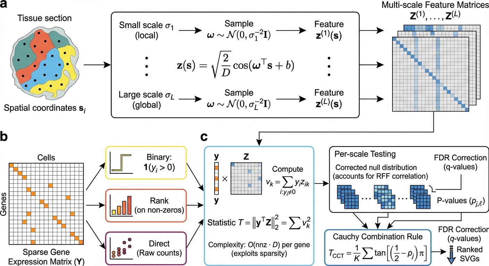

# FlashS

[](https://github.com/cafferychen777/FlashS/actions/workflows/test.yml)
[](https://pypi.org/project/flashs/)
[](https://opensource.org/licenses/MIT)
[](https://pypi.org/project/flashs/)

**Spatially variable gene detection via frequency-domain kernel testing.**

FlashS detects spatially variable genes (SVGs) in spatial transcriptomics data. It reformulates multi-scale Gaussian kernel testing in the frequency domain, where expression sparsity accelerates computation rather than complicating it.

<p align="center">
  
</p>

**Overview of FlashS.** **(a)** Spatial coordinates are transformed into Random Fourier Features (RFF), approximating kernel evaluations via inner products in a low-dimensional feature space. **(b)** A three-part test evaluates binary expression, rank-transformed intensities, and raw counts against spatial features at multiple bandwidth scales. **(c)** Per-scale p-values are combined via the Cauchy combination rule to yield a single p-value per gene.

## Why FlashS

SVG detection methods face a fundamental trade-off: expressive kernels (Gaussian, Matérn) can detect arbitrary spatial patterns — gradients, hotspots, domain boundaries — but require O(n²) distance or covariance matrices. Scalable alternatives gain speed by restricting what they can find: low-rank periodic projections, fixed polynomial bases, or nearest-neighbor approximations.

FlashS resolves this by moving the test into the frequency domain. By Bochner's theorem, Gaussian kernel evaluations decompose into inner products over Random Fourier Features, eliminating the need for any n × n matrix. Three consequences follow directly:

- **Expression sparsity helps rather than hurts.** Projections touch only non-zero entries. The 80–95% zeros typical of spatial transcriptomics make computation faster, not slower.
- **Multiple spatial scales are captured in one pass.** Tissue-wide gradients and cell-neighborhood patterns correspond to different frequency bands, all evaluated simultaneously without separate model fits.
- **The Gaussian kernel becomes practical at any scale.** Its universal approximation capacity — the ability to detect any spatially structured pattern — is no longer gated by quadratic cost.

A three-part test (binary presence, rank intensity, raw count) handles zero-inflation by decomposing spatial signal into complementary channels, and a kurtosis-corrected null distribution provides calibrated p-values without permutation.

## Installation

```bash
pip install flashs
```

With AnnData support:

```bash
pip install "flashs[io]"
```

## Quick start

```python
# Scanpy-style: results stored in adata.var
import flashs

flashs.tl.svg(adata)
sig = adata.var.query("flashs_qvalue < 0.05")
```

```python
# Standalone
from flashs import FlashS

result = FlashS().fit_test(coords, expression_matrix)
result.to_dataframe()
```

See the [quickstart notebook](examples/quickstart.ipynb) for a complete walkthrough.

## Benchmark

On the [Open Problems SVG benchmark](https://openproblems.bio/results/spatially_variable_genes/) (50 datasets across 9 spatial transcriptomics platforms), FlashS achieves a mean Kendall τ of 0.935, exceeding the next-best method (SPARK-X, τ = 0.886) by Δτ = 0.049.

On the Allen Brain MERFISH atlas (3.94 million cells, 550 genes), FlashS completes in 12.6 minutes using 21.5 GB memory while maintaining near-nominal false-positive rates under permutation.

The benchmark snapshot and method implementations are available in the [Open Problems SVG fork](https://github.com/cafferychen777/task_spatially_variable_genes/tree/flashs-benchmark-v1) at tag `flashs-benchmark-v1`.

## API

**`flashs.tl.svg(adata)`** — Scanpy-style entry point. Stores p-values, q-values, effect sizes, and per-channel statistics in `adata.var`.

**`FlashS().fit_test(coords, X)`** — Standalone interface returning a `FlashSResult` with `.significant_genes()`, `.to_dataframe()`, and `.get_spatial_embedding()`.

## Method

FlashS approximates multi-scale Gaussian kernels via Random Fourier Features, projects each gene's expression onto the spectral space through sparse sketching, and combines evidence across scales and test channels via the Cauchy combination rule. Analytic p-values are computed from a kurtosis-corrected scaled chi-squared null without permutation.

See [docs/methods.md](docs/methods.md) for the full mathematical formulation.

## Citation

```bibtex
@article{yang2026flashs,
  title   = {Frequency-domain kernels enable atlas-scale detection of
             spatially variable genes},
  author  = {Yang, Chen and Zhang, Xianyang and Chen, Jun},
  year    = {2026},
  journal = {bioRxiv},
  url     = {https://github.com/cafferychen777/FlashS}
}
```

## License

MIT
